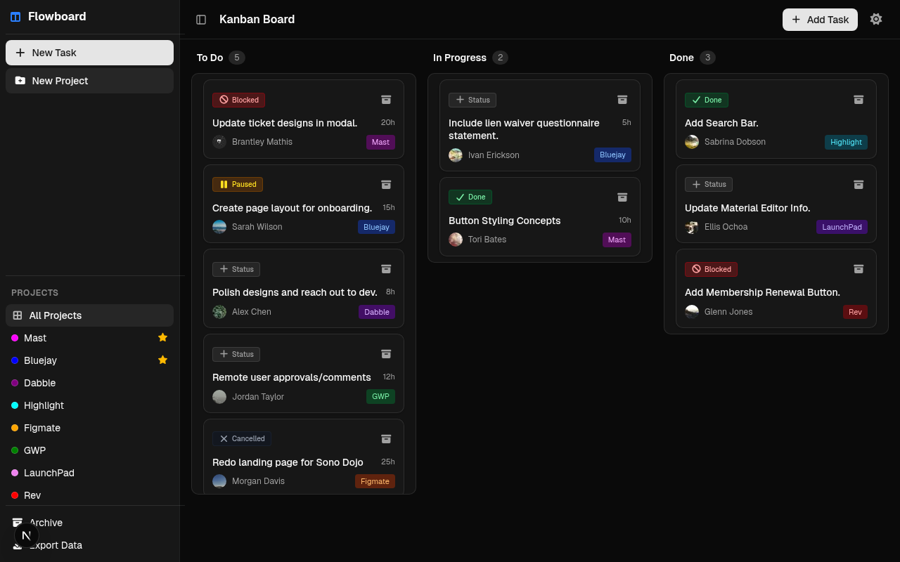
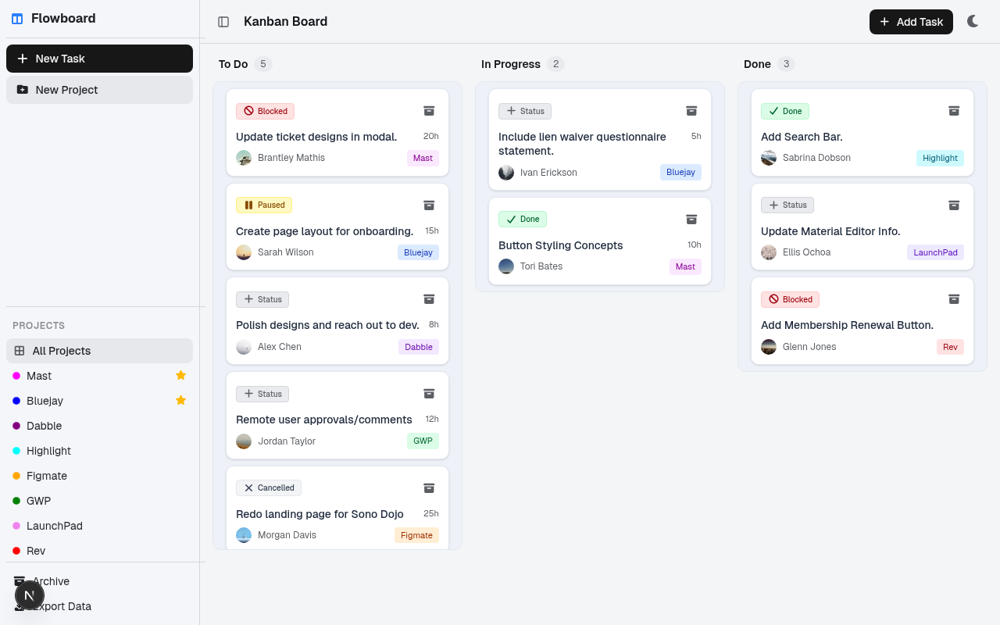
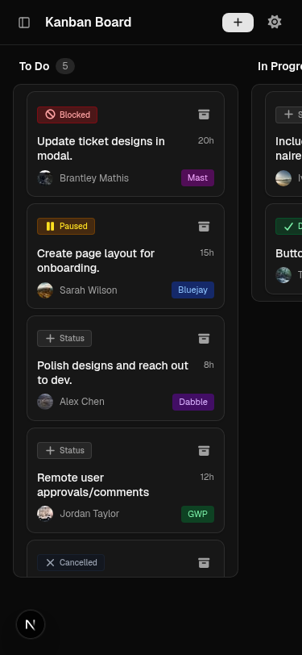

# Kanban Board

A Kanban board application built with Next.js 15, TypeScript, and Tailwind CSS. Features drag-and-drop with optimistic updates and rollback on simulated API failures, dark/light theme toggle, project management, task archiving, and responsive design.

## Screenshots

| Dark Mode | Light Mode |
| :---: | :---: |
|  |  |

<p align="center">
  
</p>

## Tech Stack

- **Framework**: Next.js 15 (App Router)
- **Language**: TypeScript (strict mode)
- **Styling**: Tailwind CSS 4 + daisyUI 5
- **Drag & Drop**: SortableJS
- **Testing**: Vitest + jsdom
- **Data**: localStorage (no backend)
- **Icons**: Font Awesome 7

## Getting Started

```bash
npm install
npm run dev
```

Open [http://localhost:3000](http://localhost:3000) in your browser.

## Scripts

| Command | Description |
|---|---|
| `npm run dev` | Start development server |
| `npm run build` | Production build |
| `npm run start` | Run production build |
| `npm run lint` | Run ESLint |
| `npm test` | Run tests |
| `npm run test:watch` | Run tests in watch mode |
| `npm run test:coverage` | Run tests with coverage |

## Features

- **Drag and drop** between To Do, In Progress, and Done columns
- **Optimistic update** with rollback on simulated API failure
- **Toast notifications** for success and error feedback
- **Project management** with custom colors and star/favorite
- **Task archiving** with restore and permanent delete
- **Status badges**: Blocked, Paused, Cancelled, Done
- **Dark/Light theme** toggle with system preference detection
- **Responsive design** with mobile sidebar
- **Data export** as JSON

## Architecture

### Optimistic Update Flow

```
1. User drags card -> SortableJS moves DOM element immediately
2. onEnd fires -> moveTaskOptimistic() updates React state (optimistic)
3. persistTaskMove() called -> 1.5s delay, 20% failure rate
4. On success: state is already correct, done
5. On failure: rollbackTaskInData() reverts state, error toast shown
```

### Mock API

`src/api/mockApi.ts` simulates a backend with:
- **1500ms delay** on every request
- **20% random failure rate** using `Math.random()`
- Throws `MockApiError` on failure with descriptive message

### Project Structure

```
rutics-board-frontend/
├── app/
│   ├── layout.tsx            # Root layout (metadata + CSS imports)
│   └── page.tsx              # Renders Board component
├── src/
│   ├── types/
│   │   └── index.ts          # TypeScript interfaces
│   ├── api/
│   │   ├── mockApi.ts        # Mock API: 1.5s delay, 20% failure
│   │   └── mockApi.test.ts   # API tests
│   ├── hooks/
│   │   ├── useKanbanBoard.ts # Board state + optimistic move
│   │   ├── useNotifications.ts # Toast notifications
│   │   └── useTheme.ts       # Dark/light theme
│   ├── components/
│   │   ├── Board.tsx         # Main board layout
│   │   ├── Column.tsx        # Kanban column (SortableJS)
│   │   ├── TaskCard.tsx      # Task card
│   │   ├── Sidebar.tsx       # Desktop sidebar
│   │   ├── MobileSidebar.tsx # Mobile sidebar
│   │   ├── AddTaskModal.tsx  # New task form
│   │   ├── AddProjectModal.tsx # New project form
│   │   ├── ArchiveModal.tsx  # Archive browser
│   │   ├── StatusMenu.tsx    # Status dropdown
│   │   ├── Notification.tsx  # Toast stack
│   │   ├── ConfirmDialog.tsx # Alert/confirm dialog
│   │   └── ThemeToggle.tsx   # Theme toggle
│   ├── lib/
│   │   ├── kanbanData.ts     # Pure data helpers + defaults
│   │   └── kanbanData.test.ts # Data helper tests
│   └── styles.css            # Global CSS (Tailwind + DaisyUI)
├── vitest.config.ts
├── tsconfig.json
├── postcss.config.mjs
└── package.json
```

## Design Decisions

1. **React state for rollback**: On mock API failure, React state is reverted and re-renders columns correctly. No manual DOM fixup needed.
2. **SortableJS retained**: Works well for drag-and-drop. Initialized via `useRef` + `useEffect` in Column.tsx.
3. **Pure data helpers**: `moveTaskInData` and `rollbackTaskInData` are pure functions for easy unit testing.
4. **Mock API**: Frontend-only simulation with configurable delay and failure rate.
5. **Data migration**: `loadData()` migrates old column IDs for backward compatibility.
6. **No external state management**: React hooks + localStorage is sufficient for this scope.
